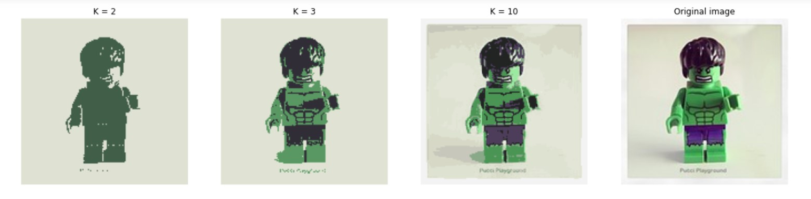
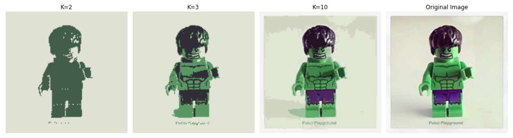

# Result_1:

This is the result of LABandHW1.ipynb, where we wrote the code of the K-means clustering algorithm for image segmentation.

# Result_2:

And this is the result of the work of the LAB1_Kabdygaliyeva_Yerkezhan.ipynb, where we used a ready-made library.

# Conclusion:

If we compare these two results, we can see that they are almost identical. That is, we presented images in 2,3 and 10 colors.
